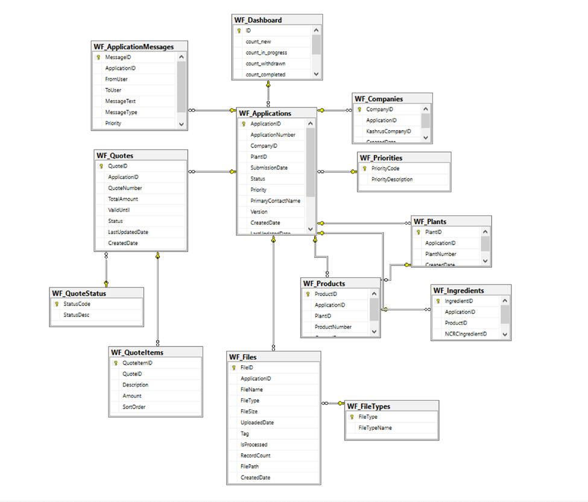
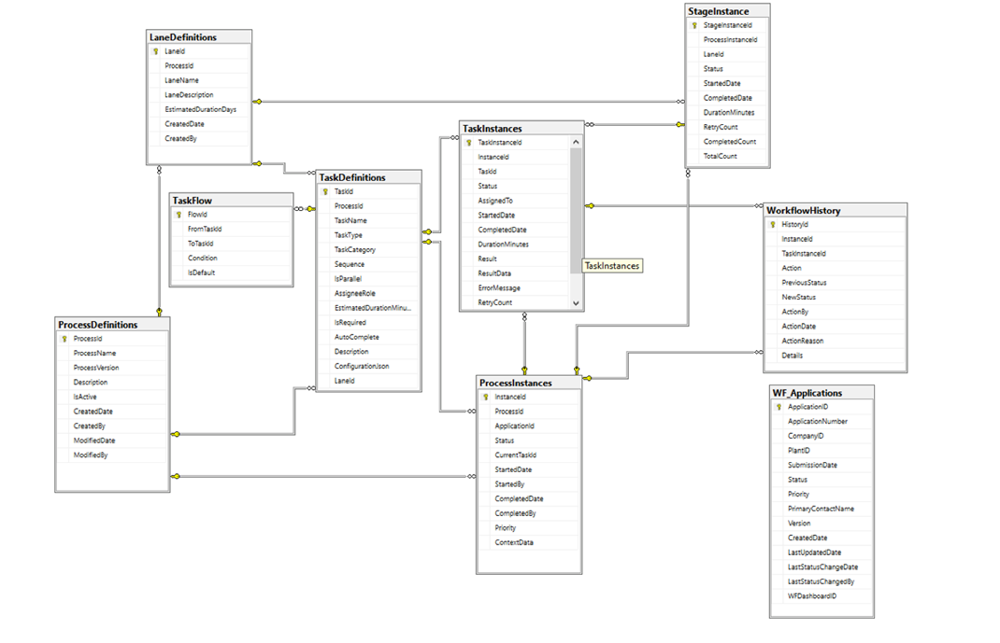

# SQL Server Deployment

```
create database dashboard;
use dashboard;
```

## OU Application
The WF_Application is the key table that links to the Legacy tables (CCOMPANYTB and PLANTTB).
```
WF_Application_NEW.sql
```

## BPMN Workflow model
The model defines Processes, Lanes, and Tasks - these are instantiated using http://{server}:{port}/start_workflow. 
```
ProcessDef_NEW.sql
ProcessData.sql
task_definitions.sql
```


## Handy SQL Scripts

View all Task Instances 
```
use dashboard;
go

SELECT TOP (1000) [TaskInstanceId]
      ,ti.[TaskId]
      ,td.[TaskName]
      ,td.[TaskType]
      ,td.[AssigneeRole]
      ,[StageId]
      ,[Status]
      ,[AssignedTo]
      ,[StartedDate]
      ,[CompletedDate]
      ,td.[EstimatedDurationMinutes]
      ,[Result]
      ,[ResultData]
      ,[ErrorMessage]
      ,[RetryCount]
  FROM [dashboard].[dbo].[TaskInstances] ti,
  TaskDefinitions td
  where ti.TaskId = td.TaskId
```